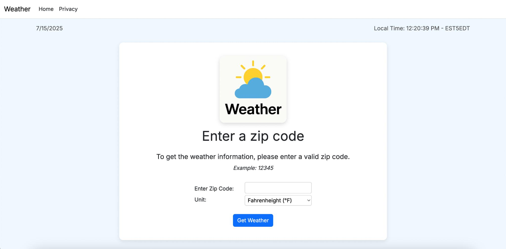
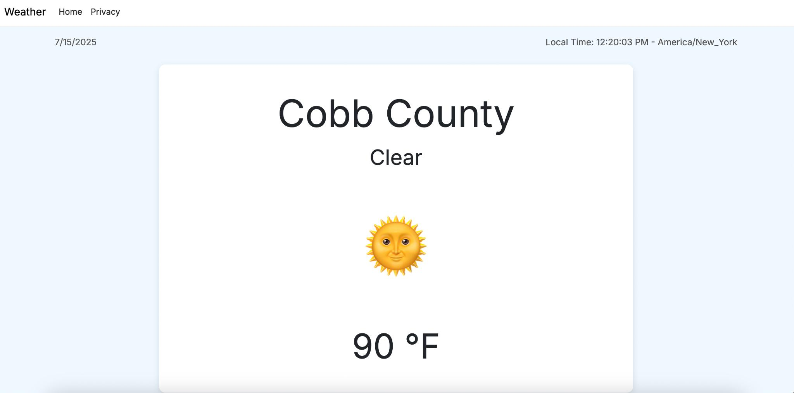

#🌤️ Weather App

**Marshall Tucker**  
Computer Science Student, Kennesaw State University  
[LinkedIn](https://www.linkedin.com/in/marshall-tucker)


This web-based weather application allows users to input a ZIP code and retrieve real-time weather data using a third-party API. Built with HTML, CSS, JavaScript, and C# (backend), the app dynamically displays temperature, city name, and current weather conditions with responsive visuals and icons.

---

## Features

- Search weather by ZIP code
- Fetches real-time data using a public weather API
- Displays:
  - Zip Code Name
  - Temperature (with unit selection)
  - Weather condition
  - Weather icon Depending on conditional logic (e.g. clouds, sun, rain)
- Custom CSS styling for a more user-friendly interface

---

## Tech Stack

- **Frontend:** HTML, CSS, JavaScript
- **Backend:** C# (.NET Core)
- **API:** OpenWeatherMap (or your provider)
- **Version Control:** Git + GitHub

## Screenshots



## Local Development Setup

1. Clone the repository:
   ```bash
   git clone https://github.com/yourusername/weather-app.git

2. Navigate to the terminal and input the correct file path for your computer to the project
3. enter 'dotnet run' into the terminal
4. hold CMD and click the link to go to the localhost
